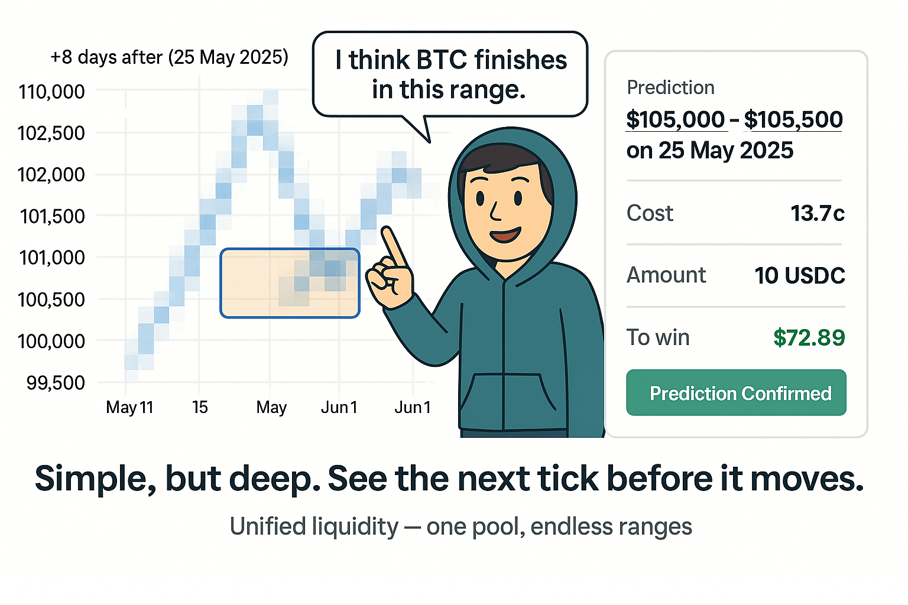

# Signals: Next-generation prediction markets for crypto market sentiment.

> Unified-liquidity **n‑outcome** prediction market for daily BTC price runs on Solana

<div align="center">

<a href="https://github.com/signals-protocol/signals-breakout-programs"></a>
<a href="https://github.com/signals-protocol/signals-breakout-frontend"></a>
<a href="https://breakout.signals.wtf"></a>
<a href="https://x.com/signalswtf"></a>
<a href="https://discord.gg/pEqJUbXDA6"></a>


</div>

## TL;DR

Signals transforms BTC price predictions into a continuous probability heat-map rather than binary YES/NO bets. Traders can **buy the exact range they believe in** while a cost-function AMM keeps prices fair.

## Problems and Solutions

There are already many indicators reflecting market sentiment (Fear&Greed Index, Funding Rate, Put-Call Ratio, etc.). However, these are all indirect indicators and don't directly predict future prices.

Prediction markets are powerful tools that can meaningfully, intuitively, and directly predict event outcomes through people's bets. Price prediction is an area of interest to many, but there is still a lack of direct and intuitive prediction market-style indicators. We believe that applying prediction market tools to price forecasting is an experiment worth pursuing.

### Limitations of Traditional Prediction Markets

The fundamental principle of prediction markets is **price = probability**. Traditional prediction markets (e.g., Polymarket) operate on the following binary outcome model:

$$
\text{Prediction Question} = \begin{cases}
\text{YES} & \text{(Event Occurs)}, \text{Price} = P(\text{Event}) \\
\text{NO} & \text{(Event Doesn't Occur)}, \text{Price} = 1 - P(\text{Event})
\end{cases}
$$

However, this model is limited to operating all questions in a binary YES/NO format. While effective for binary outcomes, it's not suitable for predicting outcomes with a continuous spectrum, such as Bitcoin prices. Polymarket attempts to solve this by creating multiple binary markets in advance, but this disperses liquidity and makes it difficult to adapt to changing market conditions.

**Signals** was designed to solve these problems:

| Problem                                               | Signals' Solution                                                          |
| ----------------------------------------------------- | -------------------------------------------------------------------------- |
| **Limited YES/NO Predictions**                        | **Continuous Price Prediction Visualization via Heatmap**                  |
| **Reduced Prediction Power from Dispersed Liquidity** | **Enhanced Prediction Power with Unified Liquidity**                       |
| **Lack of Fair Price Reflection Mechanism**           | **Accurately Reflecting Market Sentiment with Mathematical Cost Function** |

Signals also follows the "price = probability" principle, but extends it to n continuous outcomes without dispersing liquidity. A single AMM curve handles all price ranges simultaneously, and the cost function charges costs proportional to the impact a bet has on the overall distribution—large bets pay for their proportional price impact.

### Heat‑map UI

Signals provides an intuitive heatmap visualization that shows probability distribution across price ranges. Users can easily see where market sentiment is concentrated and make informed betting decisions. The darker areas represent higher probability (more bets placed) in that specific price range.

## Mathematical Model (Cost Function)

The core of Signals is a special cost function that fairly reflects the price impact based on bet size. In prediction markets, fair pricing should match probability (`price = probability`). However, large bets change the entire probability distribution, requiring a cost function that reflects this impact.

The core formula is as follows:

$$
\text{Cost} = \int_{0}^{x} \frac{q+t}{T+t} \, dt
$$

The solution to this integral is:

$$
\text{Cost} = x + (q-T) \cdot \ln\left(\frac{T+x}{T}\right)
$$

Where:

- $q$: Current token quantity in a specific bin
- $T$: Total token supply in the entire market
- $t$: Integration variable
- $x$: Token quantity to purchase

The advantages of this model include:

1. **Fair Price Impact Calculation**: The ratio of tokens in a specific bin to the total token quantity represents the probability of that bin. The integral smoothly reflects changes in cost.

2. **Dynamic Price Adjustment**: As the token quantity in a specific bin increases, the cost of additional betting also increases. This means that as the market assigns a higher probability to a particular outcome, the cost of additional betting on that outcome increases.

3. **Liquidity-Based Pricing**: As the total token supply in the market increases, the relative impact of individual bets decreases. The market becomes more stable as it matures.

### Dual Compilation Architecture

The mathematical model is implemented as a separate `math-core` Rust crate, compiled for two targets:

1. **BPF (Solana on-chain)**: Build for use in Solana programs
2. **WASM (Browser)**: Build for performing the same calculations in client applications

This dual compilation structure ensures consistency in calculation results both on-chain and off-chain.

For more details, refer to the [Mathematical Model Documentation](https://github.com/signals-protocol/signals-breakout-programs/blob/main/docs/math.md).

## Technical Architecture

- [**Solana Program**](https://github.com/signals-protocol/signals-breakout-programs): Anchor-based implementation of the prediction market logic
- [**Frontend**](https://github.com/signals-protocol/signals-breakout-frontend): React/TypeScript web interface with visualization tools
- [**Math Core**](https://github.com/signals-protocol/signals-breakout-programs/tree/main/programs/range-bet-program/math-core): Rust crate with dual BPF/WASM compilation targets

## Project Structure

```
signals-breakout/
├── signals-breakout-programs/     # Solana programs
│   ├── programs/
│   │   ├── range-bet-program/     # Main prediction market program
│   │   │   ├── math-core/         # Mathematical calculation crate (BPF/WASM)
│   │   │   └── src/               # Program source code
│   │   └── collateral_token_faucet/ # Test token provider
│   └── tests/                     # Program tests
└── signals-breakout-frontend/     # Web interface
    ├── src/
    │   ├── components/            # UI components
    │   │   ├── features/          # Feature-specific components (heatmap, etc.)
    │   │   └── layout/            # Layout components
    │   ├── web3/                  # Solana integration logic
    │   └── core/                  # App core logic
    └── public/                    # Static files
```

## How to Use

Betting is simple:

1. Select a price range on the heatmap (you can drag to select multiple contiguous bins)
2. Enter a USDC amount and check the cost and expected rewards
3. Approve the Solana transaction to complete

For detailed demo instructions, refer to the [Demo Guide](./DEMO_GUIDE.md).

## Market Opportunity

Cryptocurrency prediction markets have already reached a significant scale, occupying the Top 3 areas on Polymarket. By overcoming the limitations of traditional Yes/No betting, Signals provides a more accurate and fair price prediction market, offering users an enhanced prediction experience.

## Ongoing Research

**Fully Continuous Distribution Model**: Currently, Signals divides price ranges into discrete intervals, but we are researching to expand the model into a fully continuous probability distribution. This will enable more detailed and accurate price predictions.

## Team & Contact

Signals was a finalist at ETHGlobal Taipei, developed by the former Toaster Finance team after pivoting.

For questions or inquiries, DM [`@signalswtf`](https://x.com/signalswtf) or open an issue.

- Demo: [breakout.signals.wtf](https://breakout.signals.wtf)
- X: [@signalswtf](https://x.com/signalswtf)
- Discord: [Join our community](https://discord.gg/pEqJUbXDA6)
